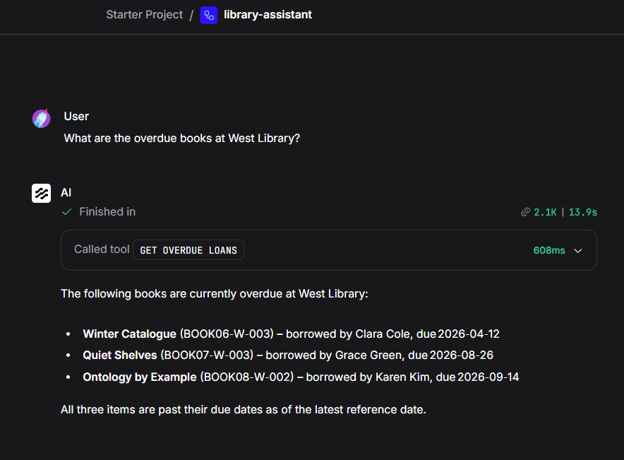

# Library Demo

## Scope

Library Demo is a toy, end-to-end, retrieval-only demonstration of controlled
access to RDF library data. It lets library administrators ask which open loans
are overdue at a library. It does not modify data and is not a production
library system. The solution defines a simple agent workflow utilizing Langflow.



Example result from the bundled fixture data.

## Quick Start

1. Start the local demo and load its data:

   ```bash
   # Place a GraphDB Free licence at infra/graphdb/graphdb.license.
   # This ignored file must not be committed.
   make demo-up
   make graphdb-load
   make graphdb-smoke
   ```

2. Open <http://localhost:7860> and import
   `workflow/library-assistant.json`.
3. Configure an approved local LLM provider in the Agent component of the workflow.
4. Ask: `Which books are overdue at West Library?`

The flow reaches the MCP service at `http://mcp:8000/mcp/` from inside Docker
Compose.

## Commands

| Target | Description |
| --- | --- |
| `make install` | Install Python dependencies. |
| `make demo-up` | Start GraphDB, MCP, and Langflow. |
| `make graphdb-load` | **Destructive:** reset and load the library data. |
| `make graphdb-smoke` | Check GraphDB and its named graphs. |
| `make down` | Stop the local services. |
| `make down-volumes` | **Destructive:** stop services and remove their volumes. |
| `make test` | Run all Python tests. |
| `make test-unit` | Run tests that do not require GraphDB. |
| `make test-integration` | Run tests that require a local GraphDB instance. |

## Repository Contents

- `src/`: The MCP service source code.
- `workflow/`: The exported Langflow flow.
- `infra/`: Local service configuration. See [infrastructure documentation](infra/README.md).
- `data/`: Toy library data for the demonstration.
- `vocab/`: The library vocabulary and ontology files.
- `docs/`: Supporting reader documentation. See the [architecture](docs/architecture/README.md) and [conceptual model](docs/conceptual-model/conceptual%20model.rtf).
