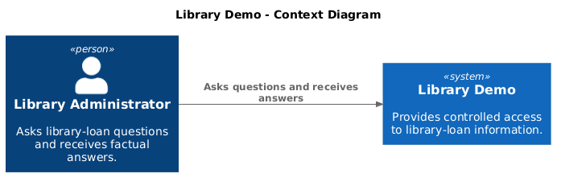
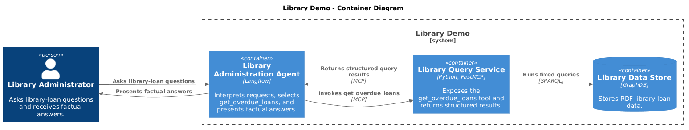
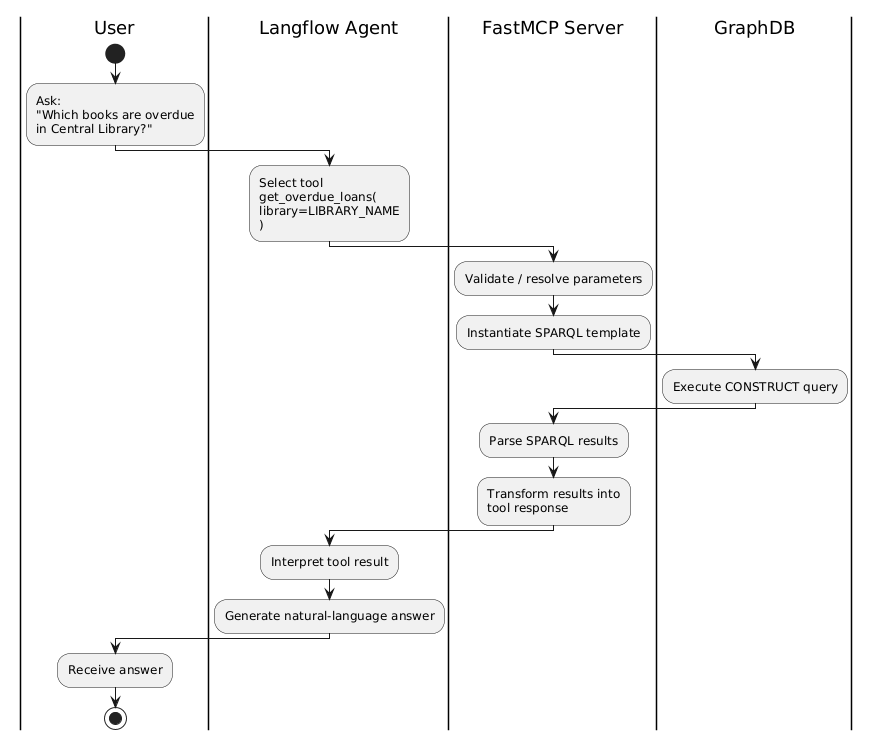

# Architecture

This document briefly describes the solution architecture using C4 diagrams.

## Context

A library administrator is the only person who interacts with Library Demo.
They ask questions and receive factual answers in natural language.

## Containers

Langflow receives the administrator's question and writes the response. It calls
the FastMCP service, which retrieves structured data from GraphDB.

## Workflow

1. The agent running inside Langflow identifies an overdue-loan request and calls the MCP tool with a library name.
2. FastMCP validates the tool input and passes it to the overdue-loans service.
3. The service runs its fixed query against GraphDB and returns a validated
   result.
4. The agent uses that result to write the administrator's response.

## Result Transformation

1. GraphDB returns an RDF projection for the fixed `CONSTRUCT` query.
2. SPARQLWrapper receives the response as an RDFLib graph.
3. RDFLib serializes the graph as JSON-LD. PyLD frames and compacts it for the
   overdue-loan projection.
4. The RDF mapper creates plain Python dictionaries from the compacted data.
5. Pydantic validates those dictionaries as the structured overdue-loan result.
6. FastMCP returns the result in the MCP exchange format for Langflow to use.

## Technical Decisions

1. **Controlled queries:** The service exposes predefined retrieval tools. It does not provide a generic query interface.
2. **MCP database boundary:** Langflow accesses library data through the MCP tool. It does not connect to GraphDB directly.
3. **Explicit result models:** Python models define the tool-specific result structures. They are manually implemented in alignment with the conceptual model, rather than generated from it. No schema introspection is used either.
4. **Clean architecture:** Models define data, adapters handle external systems, services run use cases, and entrypoints expose the MCP interface.
5. **Langflow runtime:** Langflow provides the administrator interface, selects the tool, and writes responses from structured results.
6. **SPARQL retrieval:** The service uses fixed SPARQL `CONSTRUCT` queries to retrieve RDF data (rather than tabular) for a tool result.
